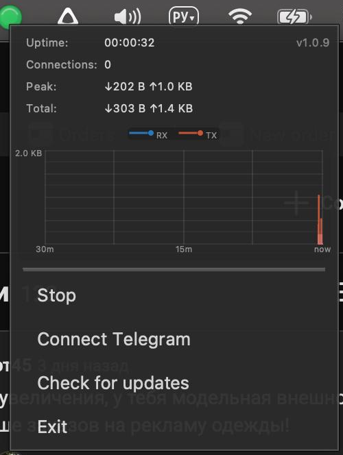

# GhostWire Desktop

  

| | |
|:---:|---|
|  | Графическая оболочка над нативной библиотекой **GhostWire** с защитой от DPI (OSI L4-L7), для **Telegram Desktop**. Приложение работает в системном трее, в User Mode, не использует внешние сервисы и сервера. |

---

## Как это выглядит

При запуске в трее появляется анимированная иконка. Правый клик открывает компактное меню.

---
## Скриншоты

### Анимированная иконка в трее

  

### Контекстное меню
Windows

  

Linux

  

macOS

  

---

## Управление

| Действие | Результат |
|---|---|
| **Правый клик** на иконку | Открыть контекстное меню |
| **Старт** | Запустить, начать приём соединений |
| **Стоп** | Остановить, очистить интерфейс |
| **Подключить Telegram** | Открыть диалог настройки прокси в Telegram Desktop |
| **Проверить обновления** | Проверить наличие новой версии на GitHub |
| **Выход** | Завершить приложение |

---

## Поведение при запуске

- **Первый запуск** — GhostWire находится в состоянии "Стоп"
- **Последующие запуски** — приложение восстанавливает предыдущее состояние. Если при завершении работы прокси был запущен, он автоматически запустится снова. Если был остановлен, то останется остановленным.

---

## Использование с Telegram

После нажатия **Старт**, можно выбрать **Подключить Telegram**:

  

Или установить конфигурацию самостоятельно:

1. Telegram Desktop → Настройки → Продвинутые → Тип соединения → SOCKS5
2. Сервер: `127.0.0.1`, Порт: `1080`
3. Сохранить

---

## Проверка обновлений

При запуске приложение автоматически проверяет наличие новой версии на GitHub (не чаще одного раза в 24 часа). При обнаружении обновления появляется уведомление в трее со ссылкой на страницу релиза.

Ручная проверка: кнопка **Проверить обновления** в контекстном меню.

---

## Поддержать автора

"Голодающим поволжья"  :pray:  **OZON Bank: 2204 2402 8673 4225**

---

