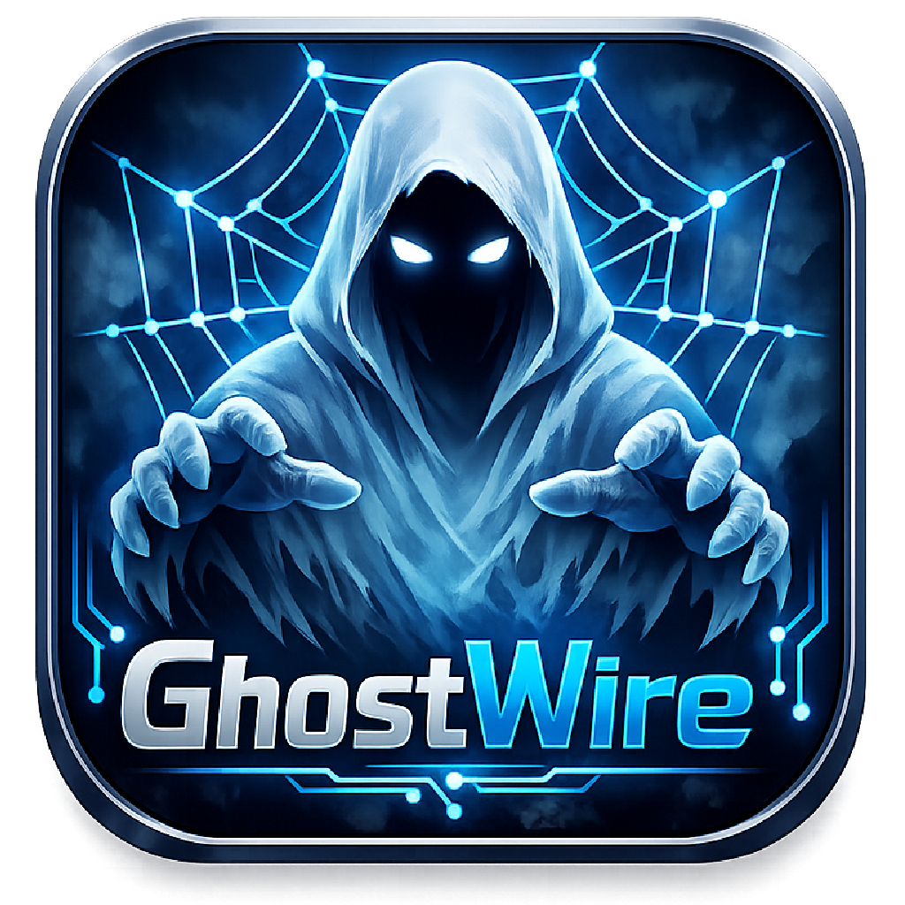
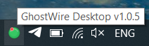
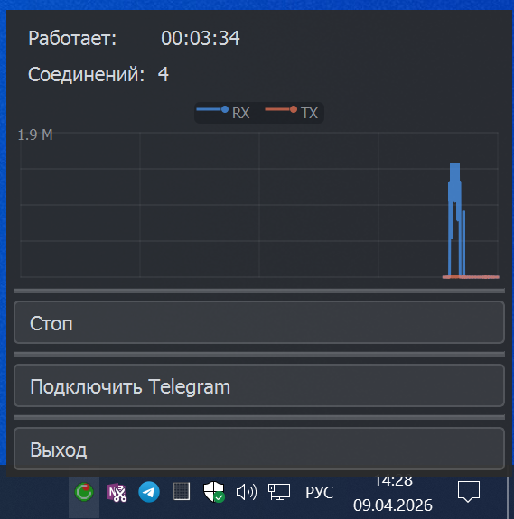

# GhostWire Desktop

  

Графическая оболочка над нативной библиотекой **GhostWire** с защитой от DPI для **Telegram Desktop**. Приложение работает в системном трее и не отображает окон на рабочем столе.

---

## Скриншоты

### Иконка в трее

  

### Контекстное меню

  

---

## Как это выглядит

При запуске в трее появляется анимированная иконка. Правый клик открывает компактное меню:

- **Статистика** — аптайм, количество активных соединений
- **Легенда RX/TX** — цветная маркировка входящего и исходящего трафика
- **График** — история трафика за последний час с autoscale по оси Y
- **Старт / Стоп** — переключатель приёма соединений
- **Выход** — завершение приложения

---

## Управление

| Действие | Результат |
|---|---|
| **Правый клик** на иконку | Открыть контекстное меню |
| **Старт** | Запустить, начать приём соединений |
| **Стоп** | Остановить, очистить интерфейс |
| **Подключить Telegram** | Открыть диалог настройки прокси в Telegram Desktop |
| **Выход** | Завершить приложение |

---

## Поведение при запуске

- **Первый запуск** — GhostWire находится в состоянии "Стоп"
- **Последующие запуски** — приложение восстанавливает предыдущее состояние. Если при завершении работы прокси был запущен, он автоматически запустится снова. Если был остановлен — останется остановленным

---

## Использование с Telegram

После нажатия **Старт**:

1. Telegram Desktop → Настройки → Продвинутые → Тип соединения → SOCKS5
2. Сервер: `127.0.0.1`, Порт: `1080`
3. Сохранить

---

## Лицензия

Copyright (c) 2026 @momentics. Все права защищены.
