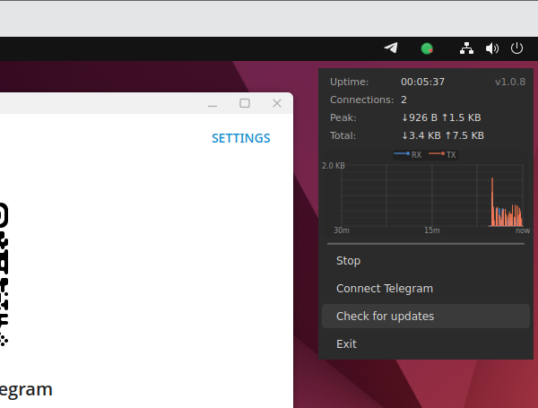
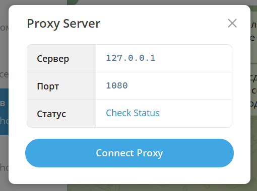

# GhostWire Desktop

  

| | |
|:---:|---|
|  | A graphical front-end for the native **GhostWire** library with DPI (OSI L4-L7) detection protection for **Telegram Desktop**. The app lives in the system tray. |

---

## What it looks like

When launched, an animated icon appears in the tray. Right-clicking it opens a compact menu.

---

## Screenshots

### Animated tray icon

  

### Context menu

  

  

---

## Controls

| Action | Result |
|---|---|
| **Right-click** the icon | Open the context menu |
| **Start** | Launch the proxy and begin accepting connections |
| **Stop** | Stop the proxy and clear the interface |
| **Connect Telegram** | Open the proxy configuration dialog in Telegram Desktop |
| **Check for updates** | Check GitHub for a new version |
| **Exit** | Quit the application |

---

## Launch behavior

- **First launch** — GhostWire starts in the "Stopped" state
- **Subsequent launches** — the app restores the previous state. If the proxy was running when the app was last closed, it starts automatically. If it was stopped, it stays stopped

---

## Using with Telegram

After pressing **Start**, you can select **Connect Telegram**:

  

Or configure the proxy manually:

1. Telegram Desktop → Settings → Advanced → Connection type → SOCKS5
2. Host: `127.0.0.1`, Port: `1080`
3. Save

---

## Update checking

On startup, the app automatically checks for new versions on GitHub (no more than once every 24 hours). When an update is found, a tray notification appears with a link to the release page.

Manual check: the **Check for updates** button in the context menu.

---
